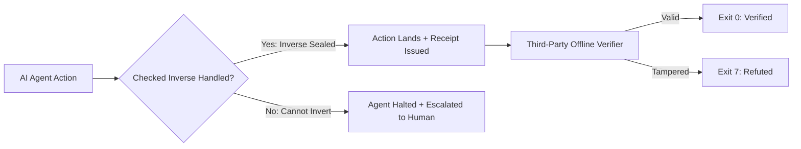

<div align="center">

<a href="https://github.com/TraceFold/tracefold"></a>

# TraceFold

### It asks before the changes it can't put back.

**Tracefold** holds a checked inverse for an AI agent's change **before** it lands, in Rust. If the inverse cannot be built, the agent stops and the decision escalates to human approval. Every verdict becomes a tamper-evident receipt verifiable offline.

[](https://www.npmjs.com/package/@mahirhir/tracefold)
[](rust-toolchain.toml)
[](lean/)
[](LICENSE)
[](https://discord.gg/rtvXqYEQzr)

</div>

---

## Flip one byte, and the verifier says no


Three files on that terminal: a receipt, a signed checkpoint, a public key. No account, no network call.
- **Valid receipt**: verifies instantly and exits `0`.
- **Flip exactly one byte**: `cmp -l` confirms the 1-byte diff, and the exact same command exits `7`.

[▶ View Asciinema Cast (Raw Timings)](https://github.com/TraceFold/tracefold/releases/download/demo-assets/tracefold-demo-10s.cast) &middot; [Read Offline Verification Mechanics](docs/articles/verify-ai-agent-actions-offline.md)

---

## Quickstart

### Route A: In Your Browser (Zero Install, Zero Network)
Open **<https://tracefold.github.io/tracefold/verify.html>** to paste a receipt and key. Verification runs 100% via in-tab WebAssembly (`fetch` and `sendBeacon` requests remain strictly at 0).

### Route B: TypeScript / Node.js (3 Lines)
```sh
npm i @mahirhir/tracefold
```

```js
import { readFileSync } from "node:fs";
import { verifyReceiptOffline } from "@mahirhir/tracefold";

const key = JSON.parse(readFileSync("key.pub.json", "utf8"));
const result = verifyReceiptOffline(
  readFileSync("commit_receipt.json", "utf8"), key.key_id, key.public_key,
  readFileSync("checkpoint.json", "utf8"), key.key_id, key.public_key
);

console.log(result.valid, result.checks.inclusion); // true "verified"
```

---

## Architecture Flow



---

## Formal Status & Measured Status

| Dimension | Measured Value | Conditions & Scope |
| :--- | --: | :--- |
| **Test Floor** | **2,602** probes | 454 suites + SDK 36 passed &middot; fresh clone &middot; 25 Aug 2026 |
| **Lean Formal Proofs** | **117** theorems | Lean 4, `sorry` 0, 12 counterexamples |
| **Open High Holes** | **0** | After 44 adversarial audit rounds |
| **Unmeasured Platforms** | 3 environments | Windows native, OneDrive, SMB |

### Scope Exclusions (Limits by Design)
| Out of Scope | Why it cannot be closed from inside |
| :--- | :--- |
| **Root or kernel-privileged writes** | Bypasses the tool entirely at the operating system level |
| **Writes into tool's own state dir** | A detector living in that directory cannot judge itself |
| **Policies encoding the wrong intent** | Enforced faithfully; intent correctness is external |

<details>
<summary><b>▶ Expand Environment, Verification & Technical Specifications (100% Lossless)</b></summary>
<br>

- **Formal Technical Report**: Complete mathematical proof and receipt encoding: [docs/TRACEFOLD_TR.md](docs/TRACEFOLD_TR.md).
- **Formal Verification Spec**: Machine-checked Lean 4 theorem suite: [lean/README.md](lean/README.md).
- **Exclusion Taxonomy**: Test-enforced scope boundaries and limits: [docs/LIMITS.md](docs/LIMITS.md).
- **Error Classification**: Error taxonomy and exit code specifications: [docs/ERROR_TAXONOMY.md](docs/ERROR_TAXONOMY.md).
- **Recoverability Mechanics**: Reversible execution state definitions: [docs/RECOVERABILITY.md](docs/RECOVERABILITY.md).
- **Development Tree Tests**: Full-spectrum test probe taxonomy: [docs/DEVELOPMENT_TREE_TESTS.md](docs/DEVELOPMENT_TREE_TESTS.md).
</details>

---

<div align="center">
<sub>Built by <a href="https://glovrex.com">Glovrex</a> &middot; Licensed under Apache-2.0</sub>
</div>
